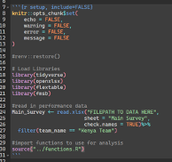

# TAPE GIZ – CAET ANALYSIS README

## CONTENTS OF ANALYSIS REPOSITORY
In this repository you should find the following:

- The script functions.R, this contains the code for a number of user-generated functions we have developed to create certain graphic and tabular outputs
- The R project file
- The folder “scripts” contains all of the analysis RMD (Rmarkdown) scripts of both Step 1 and Step 2, and where available, the soil sample analyses.

## INSTRUCTIONS

After saving the folder somewhere useful on your computer, please move the data you will have downloaded from the platform into this folder. Note that these scripts have been configured to work with the full data download from the platforms home page. This data download will contain all data for your team across multiple sheets in an excel workbook.
Open the R project file to bring up RStudio. Then open up any of the markdown scripts either through the “Files” pane in RStudio or the standard file explorer.
At the top of every script you will see a code chunk similar to the one below.

First, anytime you see “FILEPATH TO DATA HERE” replace this with  the relative file path to where you have saved the data. If you have followed as suggested, this should be “../NAME_OF_DATA.xlsx”

Next, make sure you have installed the renv package. You can install this by typing install.packages(“renv”) into the console window in RStudio.

Finally, run the code renv::restore(), this should install all the required packages for running the code.

If you have difficulties with renv::restore(), it is recommended to manually install the packages listed in the first chunk (i.e. tidyverse, openxlsx, flextable and fmsb) and those at the top of the functions.R script (agricolae and scales). Upon first opening a script, you may also be prompted about uninstalled packages by a yellow bar at the top of the script, please also click install on this should you have issues with renv.
